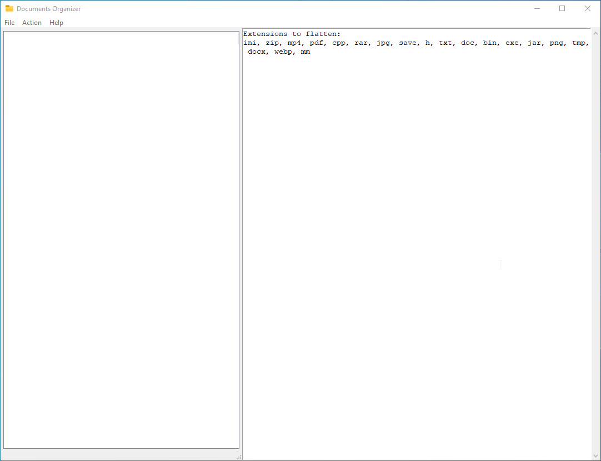
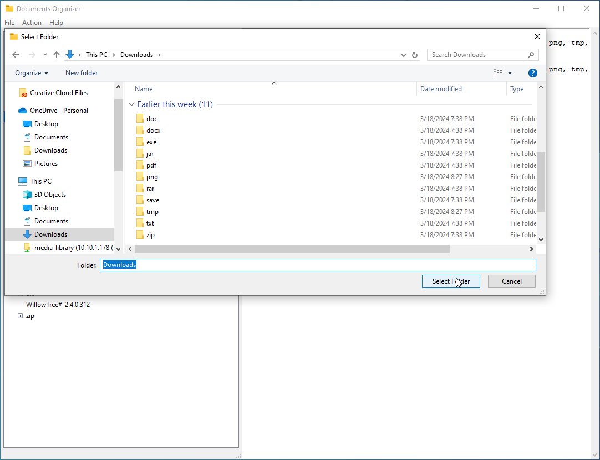
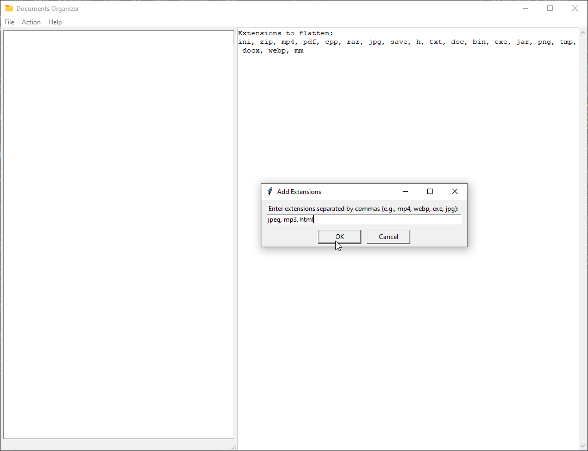
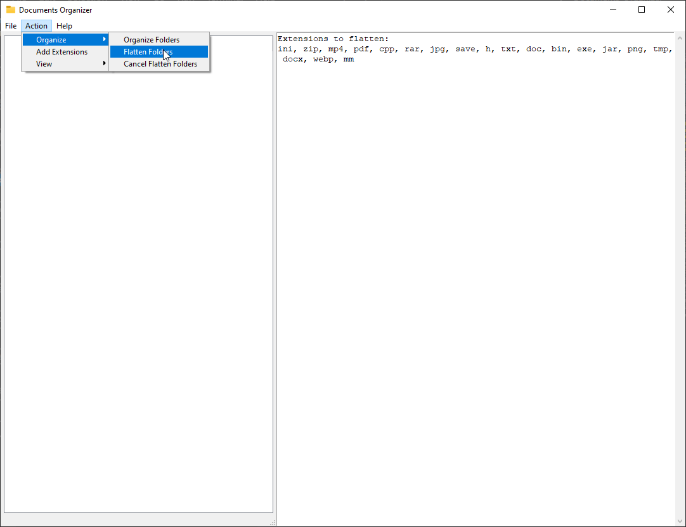
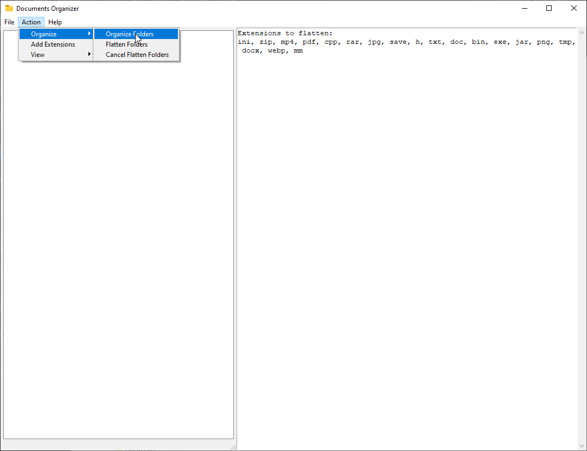

# Documents Organizer

A Python desktop utility for organizing directories by file type and modification date, flattening previously organized folder structures, and managing collections of files through a graphical interface.

Documents Organizer was created to automate repetitive file-management tasks while still giving the user control over the folder being processed and visibility into what the application is doing.

---

## Features

- **Organize Files** — Organize files into folders based on file extension and modification date.
- **Flatten Folders** — Move files out of supported nested folder structures and back into their parent folders.
- **Custom Extensions** — Add additional file extensions to the flattening workflow.
- **Cancelable Operations** — Stop a flattening operation while it is in progress.
- **Folder Selection** — Select the directory that should be organized or flattened.
- **Explorer Integration** — Open selected folders directly in Windows File Explorer.
- **Activity Log** — Monitor file operations and application messages while an operation is running.

---

## Screenshots

### Main Application

### Folder Selection

### Adding Extensions

### Flattening Folders

### Organizing Files

---

## Getting Started

### Requirements

Documents Organizer is written in Python and uses Tkinter for its graphical interface.

Before running the application, make sure you have:

- Python installed
- The dependencies listed in `requirements.txt`
- Permission to read and modify the directories you intend to organize

### Clone the Repository

Clone the repository from:

`https://github.com/DOS1986/Documents-Organizer`

Then navigate into the cloned project directory.

### Install Dependencies

Install the Python packages listed in:

`requirements.txt`

### Run the Application

Run the application's main Python entry point.

The exact setup and execution commands can be added here once the current project structure has been reviewed and verified.

---

## Usage

### Select a Folder

Choose the folder you want Documents Organizer to work with.

Always verify that the correct folder has been selected before starting an operation.

### Organize Files

Use the organize operation to sort files within the selected directory into folders based on file extension and modification date.

### Flatten Folders

Use the flatten operation to move files out of supported nested folder structures and back into their parent folders.

### Add Extensions

Additional file extensions can be added through the application when files outside the default extension list need to be included in the flattening process.

### Cancel an Operation

A flattening operation can be canceled while it is running using the application's cancellation option.

### Reveal in Explorer

Right-click a folder in the tree view to open that location directly in Windows File Explorer.

### Monitor Operations

Use the application's log to monitor progress, confirmation messages, and errors while file operations are being performed.

---

## Running a Packaged Release

Packaged Windows releases may be made available through the project's GitHub Releases page:

[Documents Organizer Releases](https://github.com/DOS1986/Documents-Organizer/releases)

If no packaged release is currently available, the application can be run directly from the Python source.

---

## Configuration

Documents Organizer does not require external configuration for normal use.

Additional file extensions used by the flattening process can be added through the application's interface.

---

## Technology

Documents Organizer currently uses:

- Python
- Tkinter
- Local filesystem operations
- Windows File Explorer integration

---

## File Safety

Documents Organizer performs operations that can move files and change directory structures.

Before using the application on important data:

- Keep a backup of the files being organized.
- Test the application on a small sample directory first.
- Verify that the correct folder has been selected before starting an operation.
- Review the application log while operations are running.
- Avoid manually modifying the same files or folders while Documents Organizer is processing them.

Use the application carefully when working with files that do not have another backup.

---

## Troubleshooting

If you encounter a problem while using Documents Organizer:

- Review the application log for error messages.
- Confirm that Python and the required dependencies are installed.
- Verify that your user account has permission to read and modify the selected directory.
- Make sure files being processed are not locked by another application.
- Try reproducing the issue using a small test directory.
- Review existing GitHub issues to see whether the problem has already been reported.

---

## Contributing

Contributions, bug reports, and suggestions are welcome.

If you would like to contribute:

1. Fork the repository.
2. Create a branch for your change.
3. Make and test your changes.
4. Submit a pull request describing what was changed and why.

---

## Issues

Found a bug or have an idea for an improvement?

[Open an issue](https://github.com/DOS1986/Documents-Organizer/issues).

When reporting a bug, please include:

- What you were trying to do
- What happened
- What you expected to happen
- Steps that reproduce the issue
- Any relevant application log output

Please avoid including private file names, paths, or other sensitive information in public issue reports.

---

## License

Documents Organizer is licensed under the [MIT License](LICENSE).

---

## Disclaimer

Documents Organizer is provided as-is without warranty.

The application performs filesystem operations that may move files and modify directory structures. Users are responsible for maintaining appropriate backups and verifying the selected directory before performing an operation.

See the [MIT License](LICENSE) for the project's licensing terms.

---

## Author

Created by [David O. Southwood](https://davidosouthwood.com).

- [Website](https://davidosouthwood.com)
- [GitHub](https://github.com/DOS1986)
- [LinkedIn](https://www.linkedin.com/in/davidsouthwood/)
