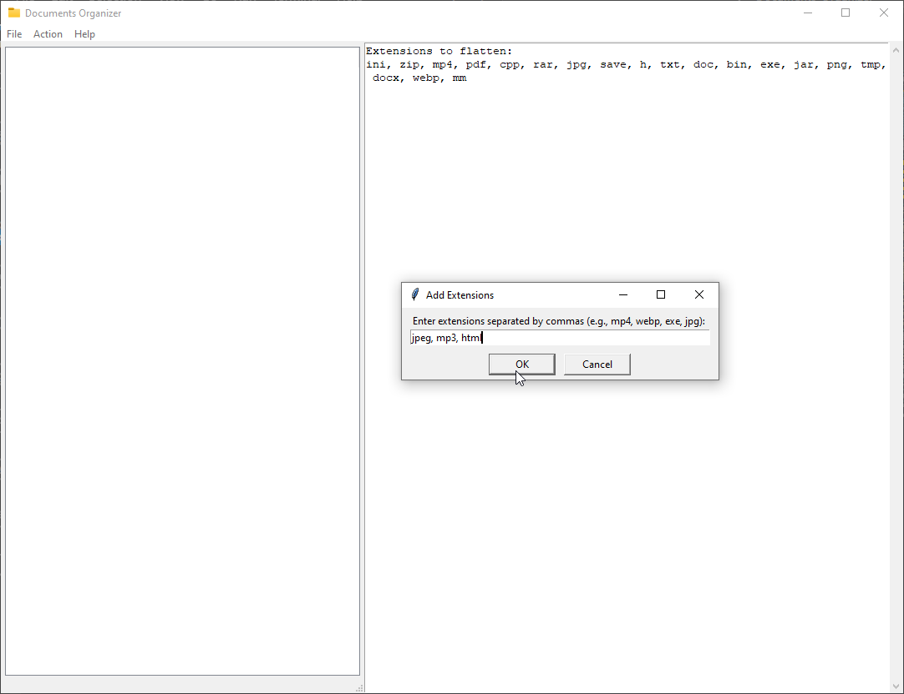

# Documents Organizer


Documents Organizer is a Python application designed to help you organize your files and folders efficiently. It provides features such as flattening folders, organizing files by extension and date modified, and more.

## Table of Contents


- [Documents Organizer](#documents-organizer)
  - [Table of Contents](#table-of-contents)
  - [Introduction](#introduction)
  - [Screenshots](#screenshots)
    - [Application](#application)
    - [Selecting Folder](#selecting-folder)
    - [Add Extensions](#add-extensions)
    - [Flattening Folders](#flattening-folders)
    - [Organizing Files](#organizing-files)
  - [Usage](#usage)
    - [To use Documents Organizer](#to-use-documents-organizer)
    - [Document Organizer Usages](#document-organizer-usages)
    - [Running the Executable (Coming soon)](#running-the-executable-coming-soon)
  - [Features](#features)
  - [Installation](#installation)
  - [Configuration](#configuration)
  - [Troubleshooting](#troubleshooting)
  - [Contributing](#contributing)
  - [Issues](#issues)
  - [License](#license)
  - [Disclaimer](#disclaimer)
  - [Contact](#contact)
  - [About](#about)

## Introduction

Documents Organizer simplifies the task of managing and organizing your documents by offering a user-friendly interface and powerful organizational capabilities. With this application, you can flatten nested folders created by using the organize folders menu item, organize files by extension and date, and maintain a tidy directory structure.

## Screenshots

### Application


### Selecting Folder


### Add Extensions



### Flattening Folders


### Organizing Files


## Usage

### To use Documents Organizer

1. Select a folder to organize or flatten.
2. Choose an action from the menu bar (e.g., Organize Folders, Flatten Folders).
3. Monitor the log for updates and confirmation messages.
4. Enjoy a well-organized folder structure!

### Document Organizer Usages

1. **Select Folder**: Choose the folder you want to organize or flatten.
2. **Organize Folders**: Automatically organize files within the selected folder.
3. **Flatten Folders**: Flatten nested folders within the selected folder.
4. **Add Extensions**: Add additional file extensions for flattening.
5. **Cancel Flatten Operation**: Stop the flattening operation in progress.
6. **Reveal in Explorer**: Right-click on a folder in the tree view to open it in File Explorer.

### Running the Executable

- Download the latest release from the [Releases](https://github.com/DOS1986/documents-organizer/releases) page.
- Extract the downloaded ZIP file.
- Double-click `document-organizer.exe` to run the application.

## Features

- **Organize Files**: Automatically organize files into folders based on their extensions and modification dates.
- **Flatten Folders**: Flatten nested folders by moving files from extension-named folders to their parent folder.
- **Add Extensions**: Easily add new extensions to the list of files to be flattened.
- **Cancel Operation**: Ability to cancel the flattening operation mid-process.
- **Right-Click Menu**: Context menu support to reveal the selected folder in Explorer.

## Installation

1. Clone the repository:

    ```bash
    git clone https://github.com/username/documents-organizer.git
    ```

2. Navigate to the project directory:

    ```bash
    cd documents-organizer
    ```

3. Install dependencies:

    ```bash
    pip install -r requirements.txt
    ```

4. Run the application:

    ```bash
    python main.py
    ```

## Configuration

Documents Organizer does not require any additional configuration. However, you can customize the list of extensions to flatten by editing the extensions_to_flatten variable in the source code if you do not feel like adding them through the .

## Troubleshooting

If you encounter any issues while using Documents Organizer, try the following troubleshooting steps:

- Check the log for error messages and follow any instructions provided.
- Ensure that you have the latest version of Python installed.
- Verify that you have the necessary permissions to access and modify the selected folders.

## Contributing

Contributions are welcome! Fork this repository, make your changes, and submit a pull request.

## Issues

If you encounter any issues or have suggestions for improvements, please [open an issue](https://github.com/DOS1986/documents-organizer/issues).

## License

This project is licensed under the [MIT License](LICENSE).

## Disclaimer

Document Organizer is provided as-is without any guarantee or warranty. Use at your own risk. The authors accept no responsibility for any loss or damage arising from its use.

## Contact

For questions or support, feel free to contact the maintainers.

## About

Document Organizer was created by David Southwood. It is written in Python and uses the Tkinter library for the graphical user interface.
